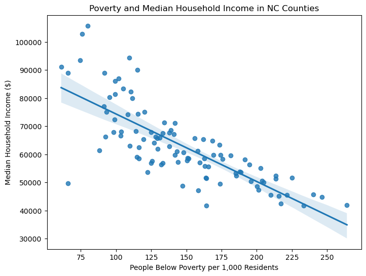
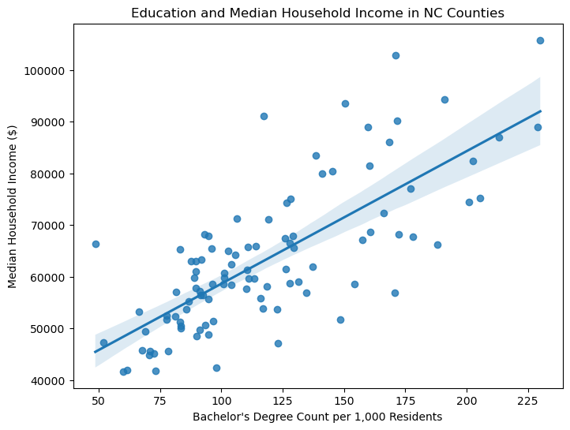

# Projects

## Project 1: Income Differences Across North Carolina Counties

### Problem Definition

My research question is:

**How are poverty, unemployment, age, education, and housing costs related to median household income across North Carolina counties?**

The goal of this project is to explore how economic and demographic factors are related to differences in household income between counties in North Carolina.

### Data Description

The data comes from the **2024 U.S. Census Bureau American Community Survey 5-Year Estimates API**.

The unit of analysis is a North Carolina county. The dataset contains all **100 North Carolina counties**.

The main variables used in the project include:

- Median household income
- Total population
- Number of people below poverty
- Number of unemployed residents
- Bachelor's degree attainment
- High school attainment
- Median age
- Median rent
- Median home value

For poverty, unemployment, bachelor's degree attainment, and high school attainment, I standardized the values per 1,000 residents. This makes counties with different population sizes easier to compare.

### Data Cleaning and Preparation

I used Python and pandas to clean and prepare the Census data.

The Census API originally returned many numeric variables as text, so I converted them into numeric values. I also renamed the columns so they were easier to understand.

I checked the dataset for missing values and Census missing-value codes. The final dataset contained data for all 100 counties.

Because counties have different populations, I created standardized variables such as poverty per 1,000 residents and bachelor's degree attainment per 1,000 residents.

### Visualization 1: Poverty and Median Household Income

The scatter plot shows a clear negative relationship between poverty and median household income across North Carolina counties. As the number of people below poverty per 1,000 residents increases, median household income generally decreases.

Although some counties do not follow the trend exactly, the overall pattern suggests that counties with higher levels of poverty tend to have lower household incomes.

### Visualization 2: Education and Median Household Income

The scatter plot shows a positive relationship between bachelor's degree attainment and median household income.

Counties with more residents holding bachelor's degrees per 1,000 people generally have higher median household incomes. Some counties fall above or below the overall trend, but the relationship appears fairly strong.

### Storytelling and Findings

Together, these visualizations suggest that education and poverty are both related to income differences across North Carolina counties.

Counties with higher levels of bachelor's degree attainment generally have higher median household incomes, while counties with higher levels of poverty generally have lower median household incomes.

These relationships should not be interpreted as proof of causation. A scatter plot cannot prove that poverty directly causes lower income or that earning a bachelor's degree directly causes county income to increase.

Other factors such as employment opportunities, local industries, location, and cost of living may also affect household income.

### Limitations, Ethics, and Reflection

This analysis has several limitations.

The data describes counties as a whole, so it does not represent the experiences of every individual living within a county. Counties may also contain communities with very different income levels that are hidden when using county-wide averages.

The analysis also focuses on relationships between variables rather than cause and effect. Other factors that are not included in the dataset may influence income.

If I continued this project, I would examine additional variables such as unemployment, median age, rent, and home values in more detail.

### Code and Transparency

The data was collected using the U.S. Census Bureau American Community Survey API and analyzed using Python, pandas, matplotlib, and seaborn.

[View the full Jupyter Notebook](census_activity.ipynb)

**AI Usage Disclosure:** I used ChatGPT (GPT-5.6 Sol) to help organize parts of the project writeup, explain code, and troubleshoot formatting. The data came from the U.S. Census Bureau API, and the analysis was completed using Python.

### Data Source

U.S. Census Bureau. American Community Survey 2024 5-Year Estimates.
