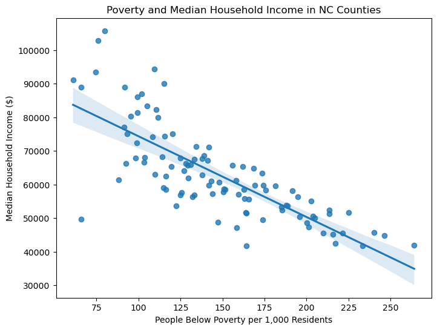
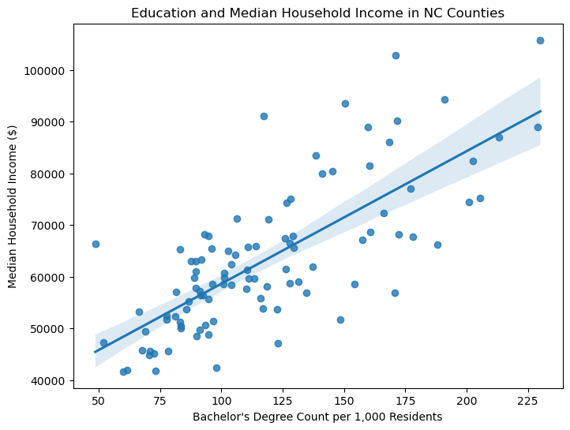

# Projects

## Project 1: Income Differences Across North Carolina Counties

### Problem Definition

My research question is:

**How are poverty, unemployment, age, education, and housing costs related to median household income across North Carolina counties?**

The goal of this project is to explore how economic and demographic factors are related to differences in household income between counties in North Carolina.

### Data Description

The data comes from the **2024 U.S. Census Bureau American Community Survey 5-Year Estimates API**.

The unit of analysis is a North Carolina county. The dataset contains all **100 North Carolina counties**.

The main variables used in the project include:

- Median household income
- Total population
- Number of people below poverty
- Number of unemployed residents
- Bachelor's degree attainment
- High school attainment
- Median age
- Median rent
- Median home value

For poverty, unemployment, bachelor's degree attainment, and high school attainment, I standardized the values per 1,000 residents. This makes counties with different population sizes easier to compare.

### Data Cleaning and Preparation

I used Python and pandas to clean and prepare the Census data.

The Census API originally returned many numeric variables as text, so I converted them into numeric values. I also renamed the columns so they were easier to understand.

I checked the dataset for missing values and Census missing-value codes. The final dataset contained data for all 100 counties.

Because counties have different populations, I created standardized variables such as poverty per 1,000 residents and bachelor's degree attainment per 1,000 residents.

### Visualization 1: Poverty and Median Household Income

The scatter plot shows a clear negative relationship between poverty and median household income across North Carolina counties. As the number of people below poverty per 1,000 residents increases, median household income generally decreases.

Although some counties do not follow the trend exactly, the overall pattern suggests that counties with higher levels of poverty tend to have lower household incomes.

### Visualization 2: Education and Median Household Income

The scatter plot shows a positive relationship between bachelor's degree attainment and median household income.

Counties with more residents holding bachelor's degrees per 1,000 people generally have higher median household incomes. Some counties fall above or below the overall trend, but the relationship appears fairly strong.

### Storytelling and Findings

Together, these visualizations suggest that education and poverty are both related to income differences across North Carolina counties.

Counties with higher levels of bachelor's degree attainment generally have higher median household incomes, while counties with higher levels of poverty generally have lower median household incomes.

These relationships should not be interpreted as proof of causation. A scatter plot cannot prove that poverty directly causes lower income or that earning a bachelor's degree directly causes county income to increase.

Other factors such as employment opportunities, local industries, location, and cost of living may also affect household income.

### Limitations, Ethics, and Reflection

This analysis has several limitations.

The data describes counties as a whole, so it does not represent the experiences of every individual living within a county. Counties may also contain communities with very different income levels that are hidden when using county-wide averages.

The analysis also focuses on relationships between variables rather than cause and effect. Other factors that are not included in the dataset may influence income.

If I continued this project, I would examine additional variables such as unemployment, median age, rent, and home values in more detail.

### Code and Transparency

The data was collected using the U.S. Census Bureau American Community Survey API and analyzed using Python, pandas, matplotlib, and seaborn.

[View the full Jupyter Notebook](census_activity.ipynb)

**AI Usage Disclosure:** I used ChatGPT (GPT-5.6 Sol) to help organize parts of the project writeup, explain code, and troubleshoot formatting. The data came from the U.S. Census Bureau API, and the analysis was completed using Python.

### Data Source

U.S. Census Bureau. American Community Survey 2024 5-Year Estimates.

## Academic References

Carneiro, P., Heckman, J. J., & Vytlacil, E. J. (2011). Estimating marginal returns to education. *American Economic Review, 101*(6), 2754–2781. https://doi.org/10.1257/aer.101.6.2754

Hoynes, H. W., Page, M. E., & Stevens, A. H. (2006). Poverty in America: Trends and explanations. *Journal of Economic Perspectives, 20*(1), 47–68. https://doi.org/10.1257/089533006776526102

Desmond, M. (2018). Heavy is the house: Rent burden among the American urban poor. *International Journal of Urban and Regional Research, 42*(1), 160–170. https://doi.org/10.1111/1468-2427.12529

---

# Project 2: Predicting College Student Academic Success

## Machine-Learning Problem

My research question is:

**How accurately can a student's academic, demographic, and socioeconomic characteristics predict whether they will graduate, drop out, or remain enrolled in college?**

This is a **multiclass classification** problem because the target variable, `Target`, has three possible outcomes: Graduate, Dropout, and Enrolled.

The purpose of this project is to explore whether machine learning can help identify students who may need additional academic or financial support. A model like this should be used to help students rather than automatically punish or exclude them based on a prediction.

## Dataset

The data comes from the UCI Machine Learning Repository dataset **Predict Students' Dropout and Academic Success**.

Each row represents one student. The dataset contains **4,424 students, 36 predictor variables, and one target variable**.

The target distribution is:

- Graduate: 2,209 students
- Dropout: 1,421 students
- Enrolled: 794 students

The predictors include academic history, admission information, demographics, socioeconomic characteristics, first- and second-semester performance, and macroeconomic variables.

The dataset contains **no missing values**.

One limitation is that the data comes from one higher-education institution in Portugal, so the results may not generalize to every university or student population.

## Data Preparation

I used Python, pandas, and scikit-learn to prepare the data for machine learning.

I removed duplicate rows and separated `Target` from the predictor variables. Selected categorical variables were one-hot encoded, while numerical variables were standardized.

I used an **80% training and 20% testing split**. The split was stratified so the proportions of Graduate, Dropout, and Enrolled students remained similar in both sets.

The preprocessing was placed inside a machine-learning pipeline so that preprocessing was learned only from the training data. This helps prevent data leakage.

## Data Understanding and Feature Selection

Before training the models, I explored the distribution of the target variable and several important academic characteristics.

I examined variables including:

- Admission grade
- Age at enrollment
- First-semester curricular units approved
- Second-semester curricular units approved

The outcome classes are not perfectly balanced. Graduates are the largest group while currently enrolled students are the smallest group. Because of this, accuracy alone may not give a complete picture of model performance.

I used all 36 available predictor variables in the models.

## Baseline and Models

I first created a baseline model using a `DummyClassifier`. The baseline simply predicts the most common outcome and provides a basic score that the trained machine-learning models should outperform.

I then compared two machine-learning models:

1. **Logistic Regression**
2. **Random Forest**

Logistic Regression provides a simpler linear classification model, while Random Forest can identify more complex and nonlinear relationships between student characteristics and academic outcomes.

## Model Evaluation

I evaluated the models using:

- Accuracy
- Macro F1 score
- Precision
- Recall
- Classification reports
- Confusion matrices

I used **Macro F1 as the primary model-selection metric** because it gives equal importance to Graduate, Dropout, and Enrolled students.

This is especially important because the three outcome classes are imbalanced. Accuracy by itself could make a model appear successful even if it performs poorly on the smaller class.

## Model Interpretation

I also examined the Random Forest model's feature importances to determine which variables were most useful when making predictions.

The analysis includes a visualization of the **15 most important Random Forest features**.

Feature importance represents how useful a variable was to the model when making predictions. It does not mean that the variable directly causes a student to graduate or drop out.

I also used confusion matrices to examine which student outcomes the models predicted correctly and which outcomes were commonly confused.

## Ethics and Limitations

There are several important limitations to this project.

The dataset comes from a single higher-education institution in Portugal, so the patterns may not represent students at other universities or in other countries.

Demographic and socioeconomic variables may also reflect existing inequalities. Machine-learning models trained on historical information can reproduce these patterns.

False negatives are important because a student who is actually at risk of dropping out could fail to receive support. False positives also matter because a student could incorrectly be labeled as being at risk.

For these reasons, this model should **not** automatically determine admissions, scholarships, course access, or other opportunities. A more responsible use would be to help identify students who could be offered optional support while still involving human review.

The model identifies predictive relationships and does not establish causation.

## Code and Transparency

The complete Python analysis is available in my Jupyter Notebook:

[View the full Project 2 Jupyter Notebook](project2_completed.ipynb)

### AI Usage Disclosure

I used **ChatGPT (OpenAI)** to help organize portions of the project, write and debug Python code, explain machine-learning steps, and draft portions of the written interpretation. I reviewed the notebook structure and code as part of completing the project.

## Sources

Realinho, V., Machado, J., Baptista, L., & Martins, M. V. (2022). Predicting student dropout and academic success. *Data, 7*(11), 146. https://doi.org/10.3390/data7110146

Realinho, V., Vieira Martins, M., Machado, J., & Baptista, L. (2021). *Predict Students' Dropout and Academic Success* [Dataset]. UCI Machine Learning Repository. https://doi.org/10.24432/C5MC89

Aulck, L., Nambi, D., Velagapudi, N., Blumenstock, J., & West, J. (2019). Mining university registrar records to predict first-year undergraduate attrition. *Proceedings of the 12th International Conference on Educational Data Mining*.

   
